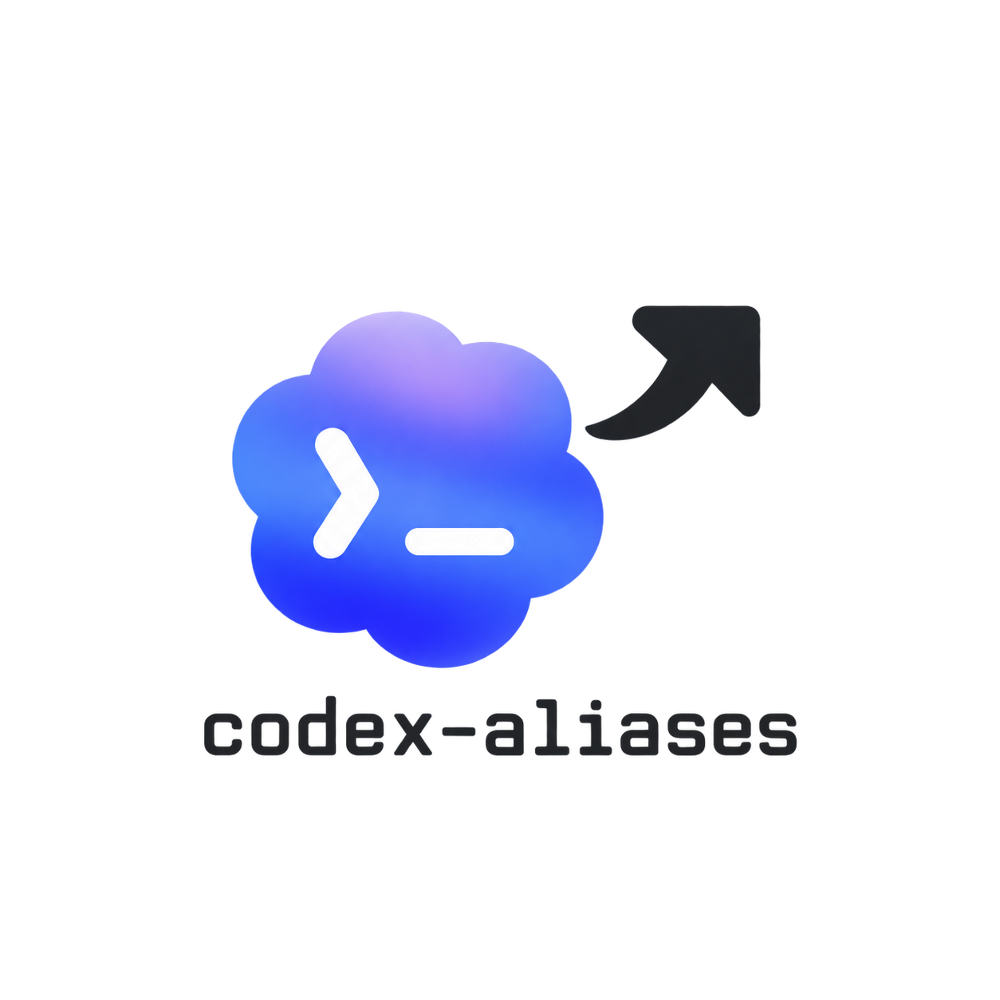

<p align="center">
  
</p>

# codex-aliases

Three shell shortcuts to launch **Codex CLI** with a specific model, inspired by [videvjs/claude-aliases](https://github.com/videvjs/claude-aliases).

| Alias | Default model | Environment variable |
| --- | --- | --- |
| `cxa` | `gpt-6-astra` | `CODEX_MODEL_ASTRA` |
| `cxs` | `gpt-6.1-sol` | `CODEX_MODEL_SOL` |
| `cxl` | `gpt-6-luna` | `CODEX_MODEL_LUNA` |

The shortcuts select a model and optionally a reasoning level. Permissions and sandbox settings remain as defined in your Codex configuration.

## Demo
https://github.com/user-attachments/assets/eb8da178-a0c0-43aa-ac9e-593e711d0b0e


[Watch the 18-second demo](./assets/demo.mp4) — a simulated terminal walkthrough showing `cxa`, followed by `cxs --high` in a second terminal.

## Installation

Requirements: Bash or Zsh, with [Codex CLI](https://developers.openai.com/codex/cli/) installed and signed in (`codex login`).

Install with one command, just like in the original repository:

```sh
curl -fsSL https://raw.githubusercontent.com/Effeilo/codex-aliases/main/install.sh | bash
```


## Usage

```sh
cxa
cxs "Explain this project"
cxl --cd ~/projects/my-app
cxs resume --last
cxl exec "Summarize local changes"
```

Arguments are passed to Codex unchanged, including prompts containing spaces.

## Reasoning effort

Place one optional reasoning flag immediately after the shortcut:

```sh
cxa --high
cxs --medium "Explain this project"
cxl --low exec "Summarize local changes"
cxa --xhigh resume --last
```

Supported shortcuts: `--low`, `--medium`, `--high`, and `--xhigh`. Without a flag, no reasoning override is added. Each flag becomes Codex's `-c 'model_reasoning_effort="LEVEL"'` option. Codex checks whether the selected model supports that level.

Only the first argument is interpreted as a reasoning shortcut; everything else is forwarded unchanged. To pass a prompt that is literally `--high`, use `cxa -- "--high"`. Native Codex `-c` options remain available for other reasoning levels.

To upgrade an existing installation, run the installation command again and open a new terminal (or source your shell profile). The installer backs up your profile and replaces its managed block. The shortcuts now use Bash/Zsh functions and remove the previous aliases when loaded.

## Choosing other models

Model IDs follow the [official Codex model documentation](https://developers.openai.com/codex/models/), checked on September 26, 2026. Availability depends on your account, client, and rollout. Use `/model` in Codex to see your available options.

You can change models without reinstalling the aliases. For example, if Sol 6.1 is not yet available on your account:

```sh
export CODEX_MODEL_SOL=gpt-5.6-sol
cxs
```

Add this `export` to your shell profile to make it persistent. Variables are read each time you invoke an alias.

## Uninstalling

Remove the block between `# >>> codex-aliases >>>` and `# <<< codex-aliases <<<` from your shell profile, then open a new terminal. To also remove the aliases from your current session:

```sh
unset -f cxa cxs cxl _codex_aliases_run
```

## Testing

```sh
bash tests/smoke.sh
```

These checks use temporary profiles and a mock Codex command: no model requests are made, and your personal shell profile is not modified.
